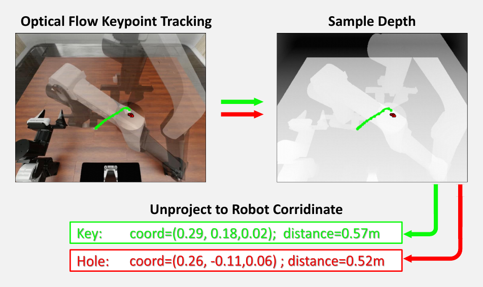
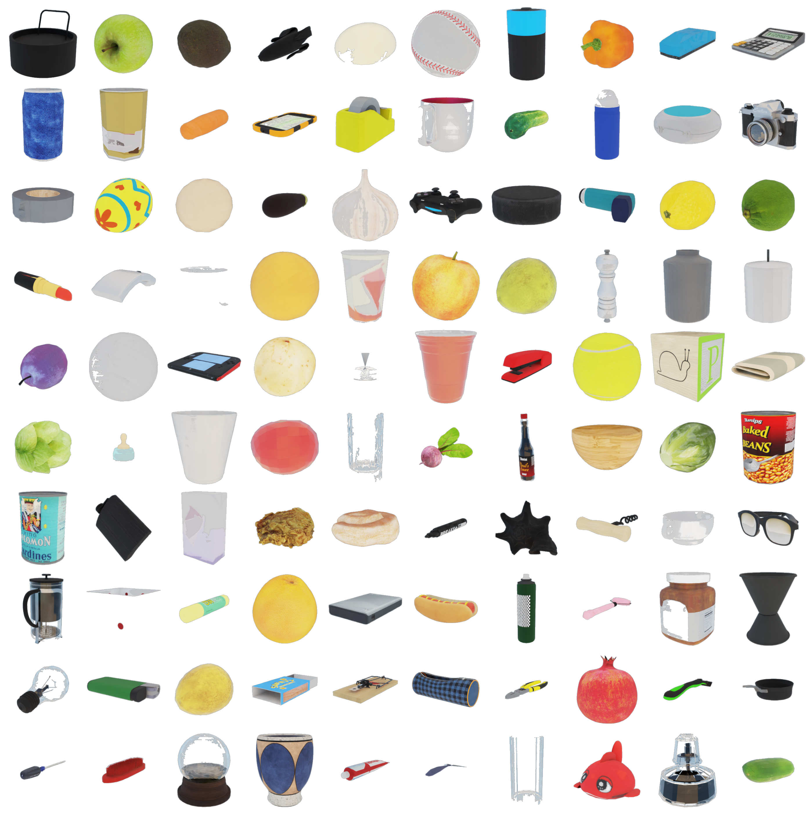
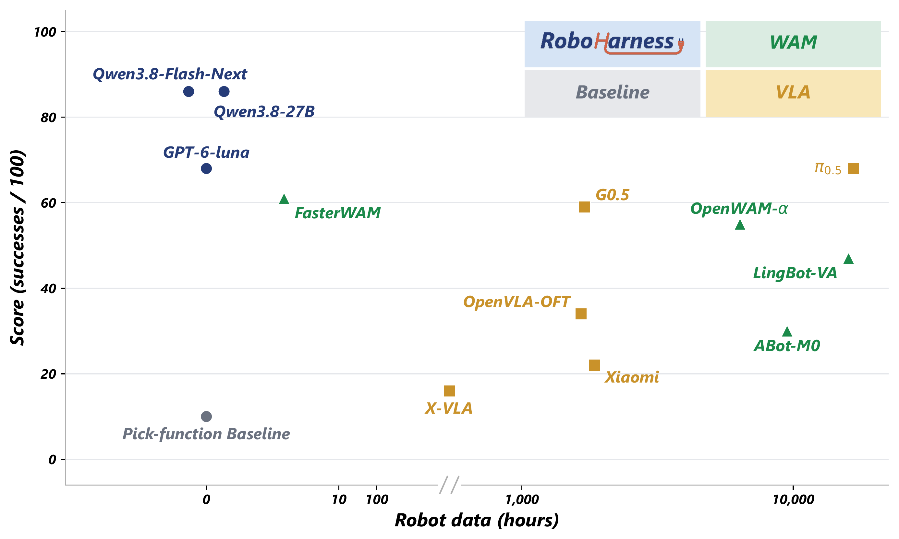

<div align="center">


### A Simple Harness Outperforms VLA and World Actions Models

**[Bince Qu](https://openreview.net/profile?id=~Bince_Qu1) · [Wei Chen](https://openreview.net/profile?id=~Wei_Chen34) · [Bo Zhang](https://openreview.net/profile?id=~Bo_Zhang9)**<br>
Zhejiang University

**[Project Page](https://cbq349.github.io/RoboHarness/) · [Quick Start](#run-a-task) · [Documentation](docs/setup.md) · [中文](README.zh-CN.md)**

[](LICENSE)
[](docs/provenance.md)
[](docs/case-prompts.md)

**A visual-geometric control panel for coding agents to perceive, reason, and act.**

<a href="docs/assets/overview.pdf"></a>

<sub>Overview figure from the paper. Its benchmark chart reports historical results; release-code validation is ongoing. [View original PDF](docs/assets/overview.pdf) · [Validation status](#validation-status)</sub>

</div>

## Overview

Run embodied robot tasks in **BEHAVIOR-1K** with **Claude Code** or **Codex**
as the agent harness. RoboHarness brings together the evaltest observation and
control interface, archived task prompts, and an official-evaluator runner that
keeps each rollout and its score independently auditable.

The release contains **9 tasks and 45 archived cases**. The reference experiments
used Claude Code 2.1.259 with `Qwen3.8-Flash-Next-FP8`; Codex is an alternative
harness and has no reference scores in this archive.

**Validation is ongoing.** The packaged reference scores are historical results,
not a claim that the released code has already reproduced every task mean. See
the [current results](#validation-status) and [recorded limitations](docs/provenance.md).

## What is included

| Component | Purpose |
| --- | --- |
| [`BEHAVIOR/`](BEHAVIOR) | Upstream submodule pinned to v3.9.1 and commit `26f2c7ef7b9cf96bd0414f81e1e751e493762779` |
| [`interface/`](interface) | evaltest interface, RGB-D tools, custom robot profile and idle gate |
| [`harness/claude_code/`](harness/claude_code) | Claude Code harness used by the reference experiments |
| [`harness/codex/`](harness/codex) | Alternative Codex harness |
| [`prompt/`](prompt) | Only the prompt texts used by the selected archived cases |
| [`tasks/`](tasks) | Instance IDs, prompt hashes, budgets, score targets and provenance |
| [`reference_results/`](reference_results) | Original evaluator scores and recorded initial observations |
| [`roboharness/`](roboharness) | Task runner, process ownership and archive-contract checks |
| [`validation_results/`](validation_results) | New evaluator scores and scoped validation evidence |

Full historical trajectories, BEHAVIOR datasets, model weights and credentials
are external to this repository. Included manifests retain source identifiers
and hashes; new trajectories are saved locally under `runs/`.

## Installation

Use Linux x86-64, an NVIDIA RTX GPU, Python 3.11 and the CUDA 12.4 toolkit.
The validation host has 48 GB VRAM per GPU; this is the tested capacity, not a
measured minimum. You also need BEHAVIOR scene data, local cache space and a
separately configured model endpoint.

```bash
git clone --recurse-submodules https://github.com/cbq349/RoboHarness.git
cd RoboHarness
./scripts/setup.sh
cp configs/example.json configs/local.json
```

Follow the [installation guide](docs/setup.md) to obtain the licensed datasets,
install Claude Code 2.1.259, and configure the model endpoint and authentication.
Edit `configs/local.json` for this machine's data and Python paths. The setup
guide also documents evaluator dependency constraints and the native asset
workaround used by this release.

## Run a task

After installation and model configuration, one command runs all five archived
instances of a task:

```bash
./run.sh --list
./scripts/reproduce_task.sh task01 --gpu 0
```

The wrapper creates a session configuration at `.local/session-config.json`
from `configs/local.json` on first use, then reuses it. Edit that session file
for later launches. It does not change global Claude or Codex configuration.

```bash
# Inspect the resolved plan without launching the simulator.
./scripts/reproduce_task.sh task03 --gpu 0 --dry-run

# Run selected actual instance IDs for diagnosis.
./scripts/reproduce_task.sh task08 --gpu 0 --instances 301,304

# Use the alternative harness with a Responses-compatible model endpoint.
./scripts/reproduce_task.sh task01 --gpu 0 --harness codex \
  --model YOUR_MODEL --model-url YOUR_RESPONSES_URL
```

Codex requires its CLI and `OPENAI_API_KEY`; see [model setup](docs/setup.md).
Instance IDs are **301, 304, 306, 308, 310**, corresponding to archived slots
**0, 3, 5, 7, 9**. A partial instance selection cannot verify a full task mean.
Task04 is unavailable because the supplied archive contains no task04 cases.

The runner starts the interface, idle gate, official evaluator and agent, then
loads each case with its archived prompt. It saves the run plan, rendered prompt,
native agent transcript, trajectory, official scoring JSON and summary under a
fresh `runs/<run-id>/` directory. Ctrl-C cleans up only that run's owned processes.

The interface is available at `http://127.0.0.1:<port>/`. HTTP defaults to
`15070 + task index`, with policy and idle-gate ports at HTTP +1000 and +2000.
Use the session file's `task_ports` mapping to choose all three listeners. The
[1507* example](docs/setup.md#session-configuration-and-ports) assigns distinct
ports to task01, task03 and task08. Use SSH forwarding for a remote host.

## Reproduction contract

- **Challenge 2025, multiplier 2.** Exact integer step limits come from the
  archived plans; the launcher rejects changes to the year, multiplier, step
  limit or evaluator revision. See the [budget table](docs/provenance.md#evaluation-budgets).
- **No additional wall-clock cap by default.** `session_timeout_s: 0` allows
  long model calls and episodes exceeding 72 hours. The simulation-step budget
  still applies. An operator-selected positive timeout is recorded; a forced
  submission cannot pass reproduction verification.
- **Per-case prompts and context.** Prompt bytes, native Skill listings,
  activated Skill bodies and MCP namespaces are checked against the recovered
  archive contract. Only historical connection-port hints are rendered for a
  new run, with both prompt hashes recorded.
- **Complete task mean Q-score.** All five instances must finish. Their
  arithmetic mean must match the directory-reported task mean within `1e-6`.
  Individual case scores may differ; tasks are checked independently.
- **Separate historical and new evidence.** Original score files are preserved.
  New runs obtain their scores from the official evaluator. Archive conflicts
  and unavailable starting-state information are documented in
  [provenance](docs/provenance.md).

Collect and check runs with:

```bash
python3 scripts/report_validation.py runs/YOUR_RUN_A runs/YOUR_RUN_B \
  --output validation_results/latest --check-live --require-match
```

Add `--watch` for continuous reporting. Use `--check-live` only on the Linux
evaluation host; it verifies recorded PIDs and process start times. Omit it for
copied runs. `--require-match` exits nonzero for incomplete, failed, mismatched
or archive-contract-invalid runs. The report retains official JSON and hashes.

## Validation status

Snapshot: **October 5, 2026, 16:43 Asia/Shanghai**. The diagnostic r5 runs have
the following completed scores after excluding wall-clock-truncated cases:

| Task | Completed, untruncated cases | Mean Q of those cases | Archived full-task mean Q |
| --- | ---: | ---: | ---: |
| task01 — picking up trash | 5/5 | 0.8000 | 0.8667 |
| task03 — cleaning up plates and food | 3/5 | 0.1905 | 0.2571 |
| task08 — rearranging kitchen furniture | 2/5 | 0.5000 | 0.4000 |

Task03/301 and task08/304 were cut off by an earlier wall-clock limit and are
excluded from this table's means. The partial means for task03 and task08 are
not full-task comparisons. Known native-context differences also make r5
diagnostic. Fresh full-task evaluations, including both mandatory retests,
remain queued; the requested three task means have **not yet been verified**.

See [validation status and evidence](docs/validation.md), the
[official score report](validation_results/gpu5-20260930-r5/README.md), and the
[case-to-prompt index](docs/case-prompts.md). Model weights and complete historical
server arguments are not available in the archive, so matching a model name
alone does not establish an identical serving configuration.

## Research figures

**From visual keypoints to robot coordinates.** Optical-flow tracking and depth
back-projection keep geometric references grounded as the scene changes.

<p align="center"><a href="docs/assets/keypoint-tracking.pdf"></a></p>

**Generalization across objects.** The paper also evaluates pick-up behavior on
100 household objects. These historical research experiments are separate from
the nine-task reproduction archive packaged here.

<table>
<tr><td width="42%"><a href="docs/assets/object-generalization.pdf"></a></td><td width="58%"><a href="docs/assets/robot-data-comparison.pdf"></a></td></tr>
<tr><td align="center">100-object evaluation catalog</td><td align="center">Pick-up success and robot-training data</td></tr>
</table>

Figures and the wordmark come from the supplied manuscript; their sources and
checksums are recorded in [the asset manifest](docs/assets/sources.json).
See [project-page maintenance](docs/project-page.md) for building the website.

## Development and license

Run the installed environments' CPU checks with `./scripts/check.sh`.
See [contribution guidelines](CONTRIBUTING.md) for focused checks and the
information needed in a reproducibility issue.

Repository code is released under the [MIT license](LICENSE), subject to the
component-specific [third-party notices](THIRD_PARTY_NOTICES.md). BEHAVIOR data,
NVIDIA Isaac Sim and model weights have their own access and license terms.
