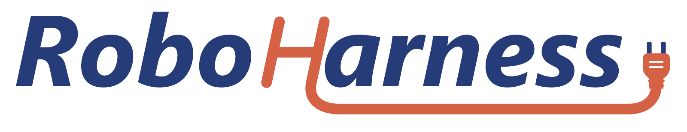
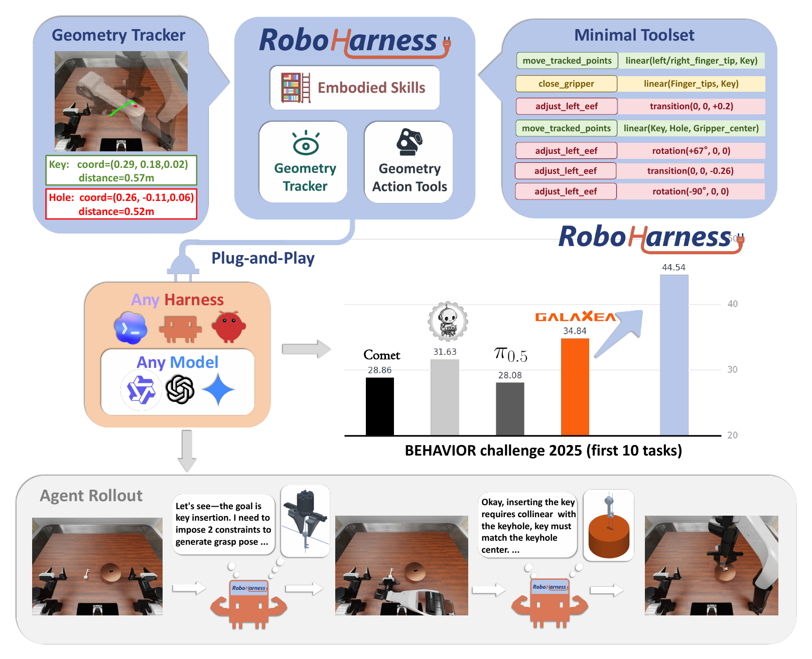

<div align="center">



### 一个简单而有效的机器人 harness

**[项目主页](https://bincequ.github.io/RoboHarness/) · [English](README.md) · [安装说明](docs/setup.md) · [任务提示词](docs/case-prompts.md)**

[](docs/assets/overview.pdf)

<sub>RoboHarness 总览：持续跟踪视觉关键点，将其转换为几何约束，并在闭环中执行与验证。[查看原始 PDF](docs/assets/overview.pdf)</sub>

</div>

## 项目介绍

**贡献者：** [BinceQu](https://github.com/BinceQu) 和 **Codex**（AI 编程助手）。

RoboHarness 无需训练模型，将视觉点选、关键点跟踪和几何约束相结合，为 LLM agent
提供具身控制面板。

LLM 在二维图像中标记感兴趣的点，并通过光流跟踪与深度反投影持续获取这些点的位置；
借助这些信息，它能够组合准确的基本动作，完成复杂操作。

BEHAVIOR 实验使用 Claude Code 2.1.259、`Qwen3.8-Flash-Next-FP8` 和 R1 Pro 机器人。
仓库同时提供 Codex harness。

## 仓库结构

```text
BEHAVIOR/           BEHAVIOR 仿真器与评测器，固定为 v3.9.1
interface/          RGB-D 观测、机器人控制和交互界面
harness/
  claude_code/      Claude Code harness
  codex/            Codex harness
prompt/             各项家居操作任务的专用提示词
tasks/              任务定义、评测实例和步数预算
reference_results/  参考评测成绩
roboharness/        任务运行与评测流程
scripts/            安装、一键运行、验证和成绩报告
validation_results/ 评测报告与成绩
```

## 安装与一键运行

需要 Linux x86-64、NVIDIA RTX GPU、Python 3.11 和 CUDA 12.4 工具链。
验证机器每卡显存为 48 GB；该值是测试环境配置，不是经过验证的最低要求。

```bash
git clone --recurse-submodules https://github.com/BinceQu/RoboHarness.git
cd RoboHarness
./scripts/setup.sh
cp configs/example.json configs/local.json
```

按[安装说明](docs/setup.md)准备 BEHAVIOR 数据、Claude Code 2.1.259 和模型服务，
并在 `configs/local.json` 中填写本机的数据目录、Python 路径和服务地址。
模型服务使用环境变量提供认证信息。环境准备好后：

```bash
./run.sh --list
./scripts/reproduce_task.sh task01 --gpu 0

# 查看计划，不启动仿真。
./scripts/reproduce_task.sh task03 --gpu 0 --dry-run

# 运行指定实例。
./scripts/reproduce_task.sh task08 --gpu 0 --instances 301,304
```

默认运行该任务的全部五个评测实例。使用 `./run.sh --list` 查看支持的任务；task04 未包含在内。

包装脚本首次运行时将 `configs/local.json` 复制到 `.local/session-config.json`，
后续复用该 session 文件。之后调整配置请修改该文件；不会改动全局 Claude 或 Codex 配置。
通过 `task_ports` 可为每个任务指定 HTTP、policy、idle gate 三个端口，
参见[全部使用 1507* 的示例](docs/setup.md#session-configuration-and-ports)。

运行器按任务配置加载场景和提示词，保存计划、会话、模型轨迹、官方评分 JSON 与汇总到新的
`runs/<run-id>/` 目录。网页接口位于 `http://127.0.0.1:<port>/`；远程访问可使用 SSH 转发。

## 复现与评分规则

论文中的 BEHAVIOR 评测设置如下：

- **每个任务使用专用 prompt，同一任务的所有实例共享该 prompt。** prompt 由人工编写，
  包含完成任务的执行步骤和模型必须遵守的行为边界，见[任务提示词](docs/case-prompts.md)。
- **每个任务评测五个实例。** 使用采样种子 `20260911`，所有任务均选取 slot
  **0、3、5、7、9**，对应实例 **301、304、306、308、310**。每个实例进行一次正式 rollout。
- **Challenge 2025，两倍步数预算。** 每个任务的最大步数为该任务人类演示平均长度的两倍，
  按仿真控制步计数。达到任务目标或步数上限时结束，见[步数预算](docs/provenance.md#evaluation-budgets)。
- **Mean Q-score。** 使用 BEHAVIOR Challenge 2025 官方评测器的 `q_score.final`，
  对全部五个实例的分数取不加权平均，报告值保留四位小数。

运行器默认使用 `session_timeout_s: 0`，不增加墙钟时限。实际运行耗时取决于硬件、模型服务和
并发负载；评测预算按仿真控制步数计算。

生成报告：

```bash
python3 scripts/report_validation.py runs/YOUR_RUN_A runs/YOUR_RUN_B \
  --output validation_results/latest --check-live --require-match
```

报告逐任务比较完整的五例均分与参考值，容限为 `1e-6`，单例分数允许不同。
`--require-match` 在任务未完成、均分不匹配或未通过评测检查时返回非零退出码。
在评测主机上使用 `--check-live`；分析复制来的运行目录时省略它。添加 `--watch` 可持续更新报告。

## 开发与许可

安装依赖后执行 `./scripts/check.sh` 运行 CPU 检查。
提交问题或修改前请阅读[贡献说明](CONTRIBUTING.md)。

仓库代码采用 [MIT 许可证](LICENSE)，第三方组件见[许可说明](THIRD_PARTY_NOTICES.md)。
BEHAVIOR 数据、NVIDIA Isaac Sim 和模型权重遵循各自的许可与访问条件。
