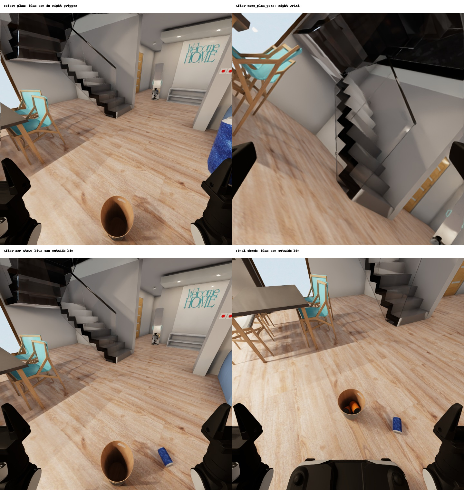

# task01/308 r5 outcome analysis — 2026-10-03

The official evaluator returned **Q = 2/3 after 5,484 steps**. The runner
recorded `model_done`, and the native agent returned without an error.
This case was not cut off by the wall-clock limit. It remains
diagnostic because r5 has known native-context mismatches.

The recorded action sequence identifies how the blue can was lost:

| Recorder turn | Observed event |
| --- | --- |
| 32 | The head image shows the blue can in the right gripper. Finger positions are approximately 0.04296 and 0.02975 m. |
| 35 | The agent requests `move_tracked_point(execution_mode="plan")`. The response explicitly reports `plan_only_no_robot_motion` and returns `plan_0002`. |
| 36 | The agent calls `exec_plan_pose(plan_id="plan_0002", arm="right")`. Its feedback records `open_selected_before_motion_then_hold_observed_qpos`: it clears the active close keepalive, applies `[3.0, 3.0]` opening effort for three steps, and observes both fingers at 0.05 m before arm motion. |
| 37 | The head image after arm stow shows the blue can on the floor outside the bin. |
| 152–153 | The final image shows two orange cans in the bin and the blue can outside. The tracker reports XY separation 0.417137853 m between the model-labelled blue-can and bin-interior points. |

The prompt's last-step rule, lines 64–74 and 180–187 of
[the archived v4 prompt](../../prompt/task01/v4_39be138fa40a.txt), directs the
agent to stop when every ignored outside can is within 0.5 m of the bin.
The final response follows that rule. The tracker marks object identity as
unverified; the image independently shows the can outside. The official
evaluator supplies the Q-score.

The corresponding successful archive uses 13 direct `move_tracked_point`
executions and three `exec_plan_pose` calls, all for plans produced by the grasp
planner. All three archived `exec_plan_pose` replies already state the same
pre-opening policy. The r5 sequence instead sends a transport plan to that
executor while holding a can.

The `move_tracked_point`, `exec_plan_pose` and pre-opening helper functions have
identical hashes in the current original interface, this release and the queued
r6 checkout. This comparison concerns those functions, not the entire original
file or a historical source snapshot. Historical tool replies independently
establish the same executor policy. The evidence identifies the immediate
release mechanism and the stopping rule; it does not establish why the model
chose a different action sequence. The corrected r6 context still requires
fresh official evaluation.

Task01's first four r5 scores are 2/3, 2/3, 1 and 2/3: their mean is 0.75.
Even Q=1 on the remaining instance 310 would produce only **0.80**, below the
directory-reported target **0.866666667**. This is an upper bound, not a completed
five-case mean. R5 cannot certify reproduction.

[audit.json](audit.json) retains official-score and source hashes, native record
locations, selected tool feedback, the archived action comparison and image
hashes. The figure contains four recorded simulator views; it does not alter
the rollout. No runtime or prompt correction is introduced by this audit.
