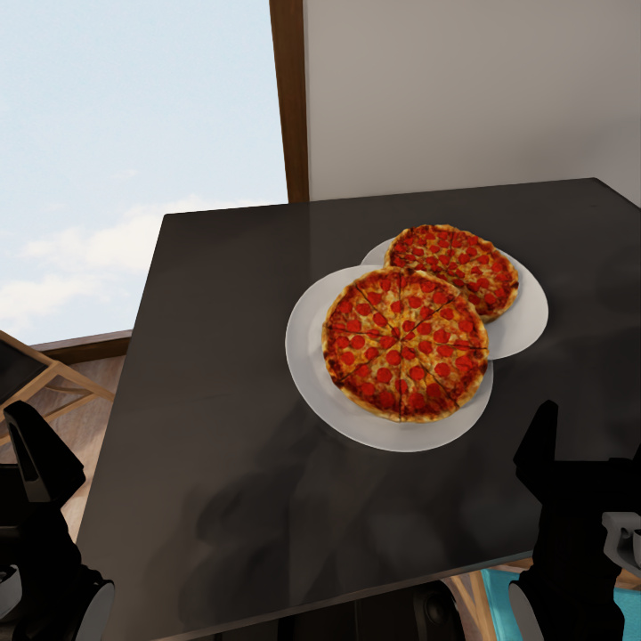
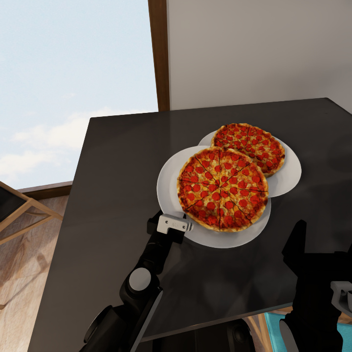
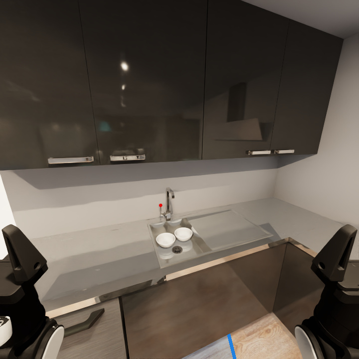
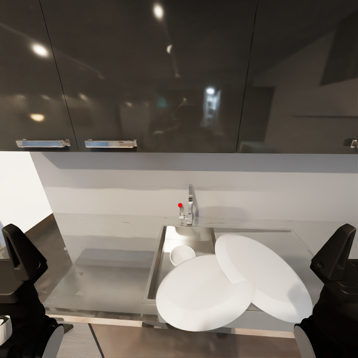

# task03/306: a plate grasp during the bowl-only task

The completed diagnostic r5 case scored **1/7 at 25,852 steps**, compared
with the directory-reported archive result **2/7 at 13,336 steps**. Its
second confirmed grasp visibly grips a plate carrying pizza. The archived
prompt explicitly limits this episode to putting two empty bowls in the
sink and excludes plates and pizza. The actual initial user messages in
both native transcripts match the archived prompt and its port-rendered
copy, respectively.

The [Skill body comparison](skill-body-comparison.json) also checks every
successful `activate_skill` response in these two completed transcripts.
All six archived and four r5 responses contain the same byte-identical
`pick-up-object` or `place-object-in-container` body as the release and
queued r6 files. This excludes a different activated Skill body for this
case; it does not establish identical activation order or native context.

The selected recorder sequence establishes the execution difference:

| Recorder turn | Evidence |
| --- | --- |
| 442 | The current image, img_0390, shows overlapping plates carrying pizzas at the subsequently selected location. |
| 446 | The model requests grasp planning at pixel (355,435) on img_0390; the planner returns plan_0015. |
| 447–449 | The left arm executes plan_0015, the gripper reports grasp_confirmed=true, and the next head image shows the gripper on the plate rim. |
| 514, 523 | The left gripper opens near the sink; the final image shows overlapping white tableware obstructing the basin and only one clearly visible bowl. |

The planner's recorded input pixel is also (355,435), with a depth hit at
(354,436). The native image contract is 720×720 pixels, with conversion to
the interface's 0..1000 coordinates and back. This selection shows no
displacement from that conversion. The geometric planner reports that it
does not use simulator object identity or segmentation; its successful
plan does not certify that the selected object is a bowl.

Before the second grasp (turn 442):

After confirmed closure (turn 449):

Archive final view, showing two bowls inside the sink:

R5 final view (turn 523):

The six compared grasp, execution, gripper and arm-positioning functions
are identical in the release, the current original interface and the
queued r6 checkout. This compares those functions, not entire modules or
the unrecorded historical deployment. The native transcripts contain 330
archived tool calls and 532 r5 calls, with no duplicate call IDs; r5 has
two confirmed gripper closures, at recorder turns 245 and 448.

These images establish a wrong-object grasp and a visibly different final
arrangement. They are not simulator object-ID or grounded-predicate dumps.
The official result contains only aggregate Q; it cannot by itself name
the predicate responsible for the missing 1/7. The pinned metric credits
newly satisfied grounded predicates, so image appearance cannot replace
its evaluation. The evidence also does not isolate why the model chose
the plate. Known r5 native-context differences remain, and the corrected
fresh r6 task means still require verification.

No prompt, tool policy, scoring rule or active rollout was changed for
this diagnosis. The [completion audit](../task03-306-r5-completion-20261004/README.md)
records the normal end after more than 49 hours and the subsequent handoff;
this case was not wall-clock truncated. The earlier truncated task03/301
remains a mandatory fresh retest. Acceptance remains the complete five-case
task mean, rather than a requirement to match this individual case.

[audit.json](audit.json) preserves source and image hashes, both native
prompt hashes, the selected call/result metadata and recorder entries,
coordinate evidence and the six function comparisons. The images are
unmodified copies from the archived or newly recorded trajectories.
